# Homework - Lists and tuples.

### hw5-1 - Check if the list is sorted in ascending order.

### Test cases

## Test case 1
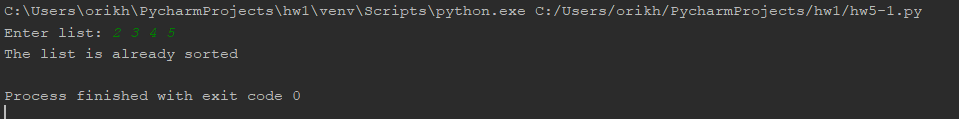

## Test case 2
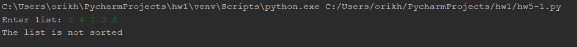

## Test case 3
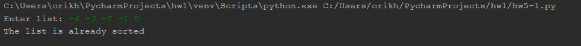

## Test case 4
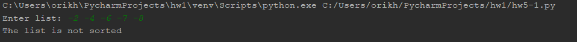

## Test case 5
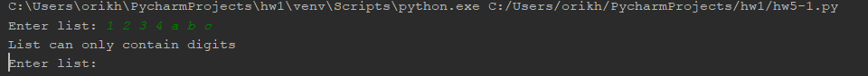

## Test case 6
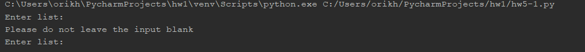

## Test case 7
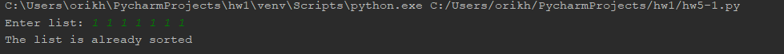

## Test case 8
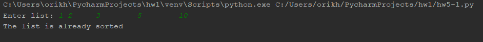

### hw5-2 - Multiply matrix.

## Test case 1
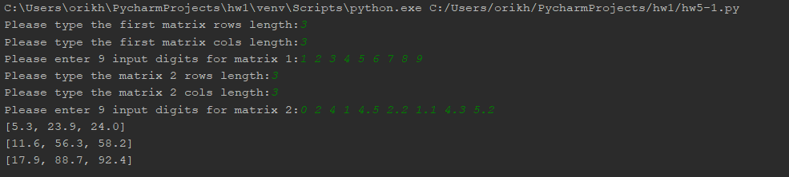

## Test case 2
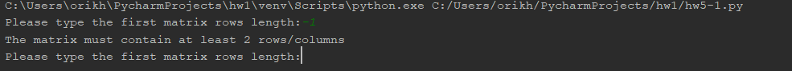

## Test case 3
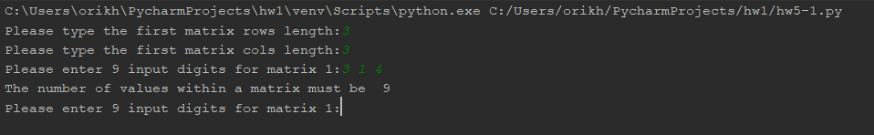

## Test case 4
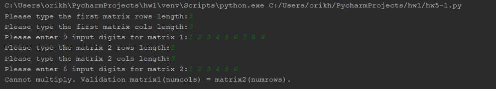

## Test case 5
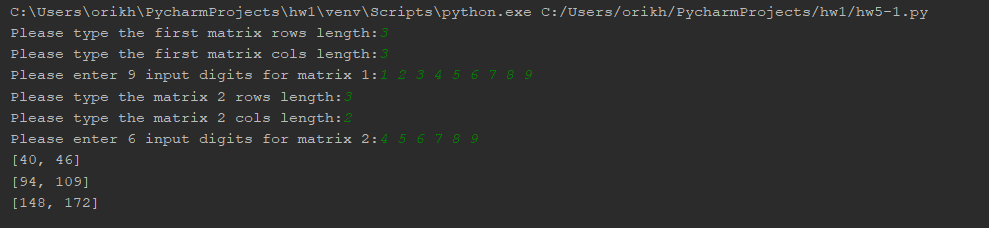

