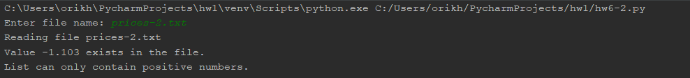

# Homework - Charts - Pie chart and line chart

### hw6-1 - Get the expenses from a file and display in a pie chart.

### Test cases

## Test case 1

## Test case 2

## Test case 3

## Test case 4

### hw6-2 - Get the prices of the gas weekly average from a file and display in a line chart.

## Test case 1

## Test case 2

## Test case 3

## Test case 4

