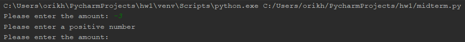
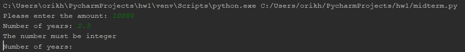

# Homework - Loan amortization caluculator.

### Test cases

## Test case 1

## Test case 2

## Test case 3

## Test case 4

## Test case 5

## Test case 6

## Test case 7

## Test case 8

## Test case 9

## Test case 10

## Test case 11

